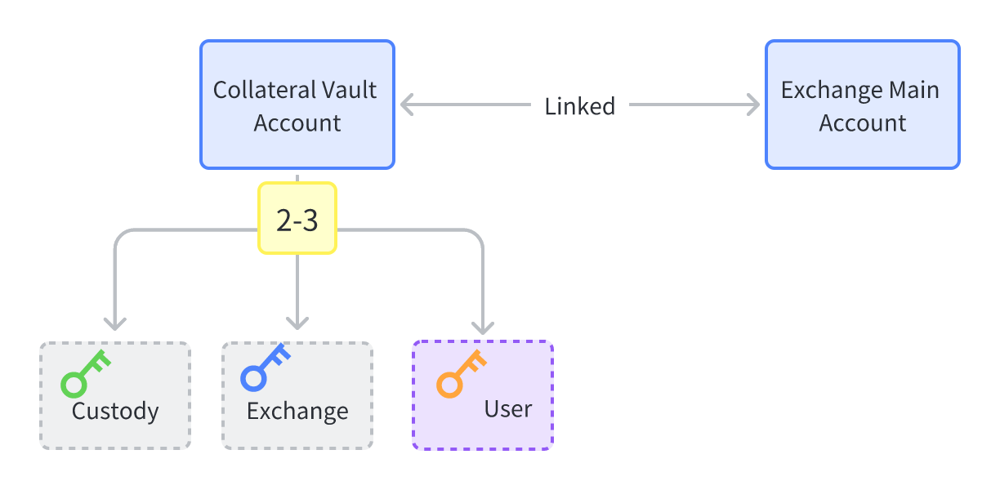
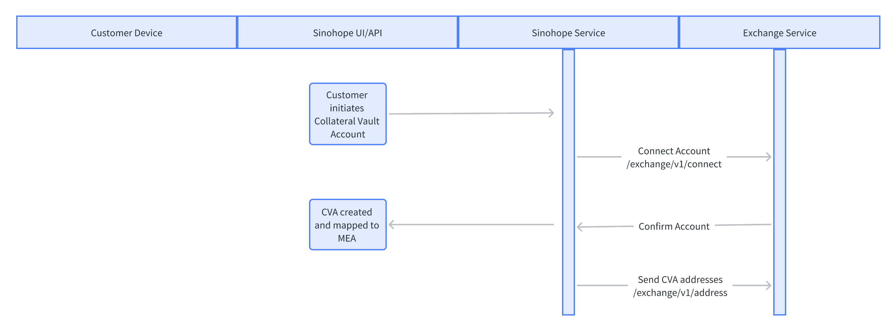
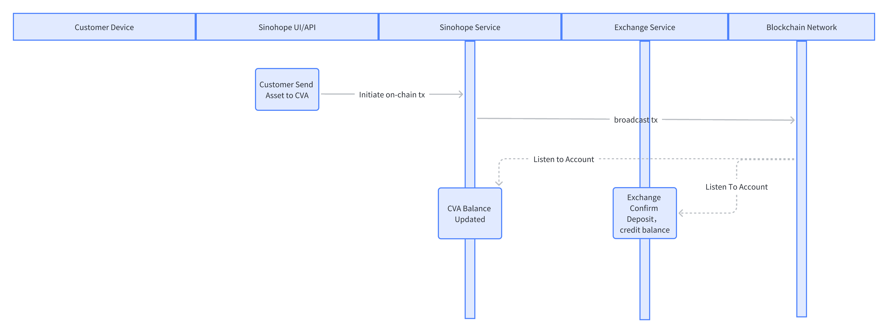
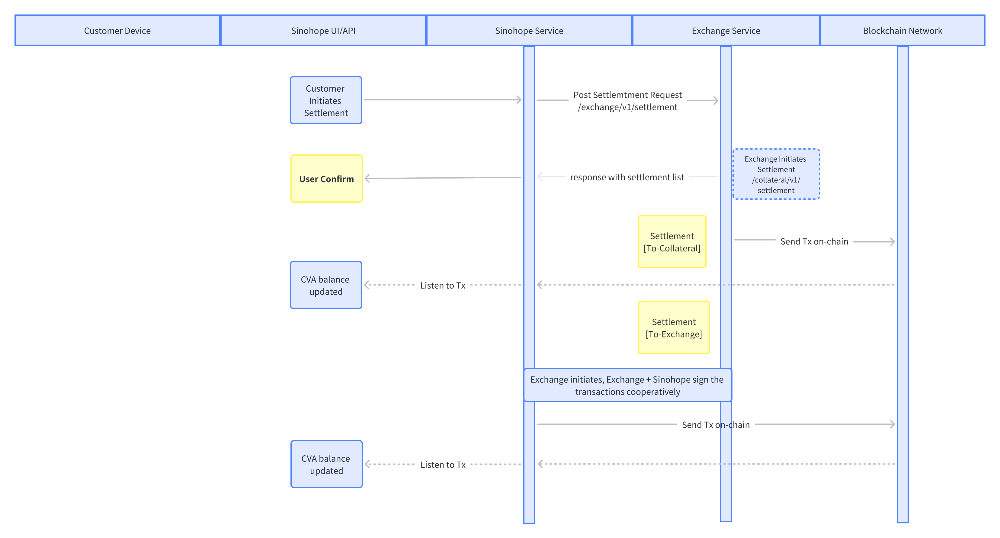
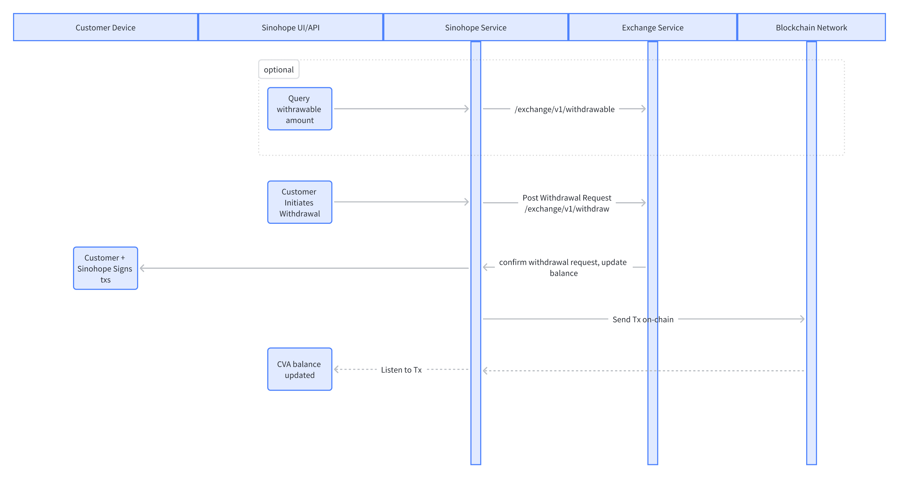

# 文档变更记录

Changes log, dates are displayed in UTC, shows in a reverse order.

### v0.9.0
> 2023/08/04 by Sinohope

-  add sinohope WaaS Api Document

First version

# 术语定义
<!-- 
# Main Steps

## Initiate





## Deposit



## Settlement



## Withdrawal



-->
# 关于Sinohope WaaS API
## 概述

Sinohope 使用基于P-256曲线（又名prime256v1或secp256r1）和算法为SHA256withECDSA的 ECDSA 签名方案进行验证，您在 Sinnohope 开通账户以后，可以在您本地生成公私钥对,参考该URL下Sinnohope提供的例程：https://github.com/sinohope/sinohope-java-api，如有任何疑问，也可以联系我们的工作人员协助您。

您可以通过 Sinnohope Web 管理界面录入您的公钥 API Key （可选择类型：查询；所有）。 API Secret 请您自己妥善保管，不要透露给任何人，避免资产损失！ Sinnohope 强烈建议您绑定您的IP地址白名单以及启用“API回调”中的提现确认。

Sinnohope 的 API 请求，除公开的 API 外都需要携带 API Key 以及签名，请注意: Sinohope POST接口仅支持JSON数据格式。

# 签名认证

签名数据由以下键值对数据组成：

| key | value | notes |
| --- | --- | --- |
| data | 请求参数所组成的字符串值，详见下文 `DATA`部分的具体说明|  |
| path | 请求URL的PATH部分， 例如https://api.develop.sinohope.com/v1/test/ 为 /v1/test/ |  |
| timestamp | 访问 API 时的 UNIX EPOCH 时间戳 (精确到毫秒) |  |
| version | 固定值`1.0.0` |  |
| "" | 公钥字符串 |  |

对于上述的键值对，按 key 的字母序生序排序后，将所有 `key``value`直接拼接起来（中间没有连接符，其中最后的 公钥字符串没有 key字段）形成最终的待签名数据字符串；连接完成后，使用您本地生成的私钥（privateKey），对数据使用私钥进行 ECDSA 签名（具体算法为 `SHA256withECDSA`），并对二进制结果进行 Hex 编码, 即生成了用于向 API 服务器进行验证的最终签名 （可参考 Sinohope 例程：https://github.com/sinohope/sinohope-java-api）。

各部分解释如下：

## DATA
如果是GET请求：
```html
https://api.develop.sinohope.com/v1/test?username=username&password=password
```
则先将参数 key 按照字母排序，然后进行 url 参数化，即：
password=password
username=username
因为 p 在字母表中的排序在 u 之前，所以 password 要放在 username 之前，然后使用 & 进行连接，即： password=password&username=username
代码示例：
```java
TreeMap params = new TreeMap<>();
params.put("username", "username");
params.put("password", "password");

private static String composeParams(TreeMap params) {
  StringBuffer sb = new StringBuffer();
  params.forEach((s, o) -> {
    try {
      sb.append(s).append("=").append(URLEncoder.encode(String.valueOf(o), "UTF-8")).append("&");
    } catch (UnsupportedEncodingException e) {
      e.printStackTrace();
    }
  });
  if (sb.length() > 0) {
    sb.deleteCharAt(sb.length() - 1);
  }
  return sb.toString();
}
```
如果是POST请求：
```java
{
  "username": "username",
  "password": "password"
}
```
则将body整体参数当做String字符串来处理。

## PATH
请求URL的PATH部分， 例如https://api.develop.sinohope.com/v1/test/ 为 `/v1/test/`

## TIMESTAMP
访问 API 时的 UNIX EPOCH 时间戳 (精确到毫秒)

## VERSION
固定值`1.0.0`

## PUBLICKEY
您本地获取的公钥，按 `X.509` 格式序列化后的字节数组再按 HEX 编码后的字符串。

## 获取公私钥代码示例
```java
public void getPublicKeyAndPrivateKey() throws Exception {
  ECDSA ecdsa = new ECDSA(SECP256R1);
  KeyPair keyPair = ecdsa.generateKeyPair();
  String publicKey = Hex.toHexString(keyPair.getPublic().getEncoded());
  String privateKey = Hex.toHexString(keyPair.getPrivate().getEncoded());
  System.out.println("publicKey = " + publicKey);
  System.out.println("privateKey = " + privateKey);
}
```

## 请求HEADER
BIZ-API-KEY

BIZ-API-SIGNATURE

BIZ-API-NONCE

获取header方式如下：
BIZ-API-KEY：您本地获取的公钥publicKey作为apiKey。

BIZ-API-SIGNATURE：先组装成待签名数据后对数据使用私钥进行 ECDSA 签名，并对二进制结果进行 Hex 编码, 即生成了用于向 API 服务器进行验证的最终签名 （可参考 Sinohope 例程：https://github.com/sinohope/sinohope-java-api)。

BIZ-API-NONCE：访问 API 时的 UNIX EPOCH 时间戳 (精确到毫秒)。

## 组装待签名数据和签名代码示例
```java
String[] msg = doGenerateSignMetaDataAsString(apiKey, path, params);

public static String[] doGenerateSignMetaDataAsString(String publicKey, String path, String data) {
  Map map = new HashMap<>(4);
  map.put(Constants.TIMESTAMP, String.valueOf(LocalDateTime.now().toInstant(ZoneOffset.of("+8")).toEpochMilli()));
  //System.out.println("BIZ-API-NONCE is -> " + map.get(Constants.TIMESTAMP));
  map.put(Constants.PATH, path);
  map.put(Constants.VERSION, "1.0.0");
  map.put(Constants.DATA, StringUtils.isNotBlank(data) ? data : "");
  String signMetaData = map.keySet().stream()
          .sorted(Comparator.naturalOrder())
          .map(key -> String.join("", key, map.get(key)))
          .collect(Collectors.joining()).trim()
          .concat(publicKey);
  return new String[]{signMetaData, map.get(Constants.TIMESTAMP)};
}

String signature = signer.sign(msg[0], signer.parsePKCS8PrivateKey(privateKey));
```
msg[0]：组装的待签名数据，生成规则如下：

时间戳（TIMESTAMP）：访问 API 时的 UNIX EPOCH 时间戳 (精确到毫秒)。

请求路径（PATH）：请求URL的PATH部分， 例如https://api.develop.sinohope.com/v1/test/ 为 /v1/test/。

版本号（VERSION）：固定值1.0.0。

请求数据（DATA）：如果数据为空则传空串。

由以上4项数据组装成key和value键值对，对key进行自然排序并转换成key和value相连接的String字符串之后在后面拼接publicKey字符串，最后去除头尾空白符。

msg[1]：TIMESTAMP时间戳，即对应请求头（BIZ-API-NONCE）。

signature：对应请求头（BIZ-API-SIGNATURE）。

## 完整示例
GET请求：
| Method | URL |
| :--- | ---: |
| GET | https://api.develop.sinohope.com/v1/test?username=username&password=password |

参数：
| Parameter | Value |
| :--- | ---: |
| username | username |
| password | password |

待签名数据为：
```html
datapassword=password&username=usernamepath/v1/testtimestamp1690959799750version1.0.03056301006072a8648ce3d020106052b8104000a03420004d8caf9385ee3f28df77eab42a0da4b8dc9462a8ad39dbb224c2802cc377df9dc09ac23d04748b40c2897d91bbd7fe859476c6f6fe9b2aa82607e8a48f9b7ac0d
```
POST请求：
| Method | URL |
| :--- | ---: |
| POST | https://api.develop.sinohope.com/v1/test |

参数：
```html
{
  "username": "username",
  "password": "password"
}
```
待签名数据为：
```html
data{"username":"username","password":"password"}path/v1/testtimestamp1690961714929version1.0.03056301006072a8648ce3d020106052b8104000a03420004d8caf9385ee3f28df77eab42a0da4b8dc9462a8ad39dbb224c2802cc377df9dc09ac23d04748b40c2897d91bbd7fe859476c6f6fe9b2aa82607e8a48f9b7ac0d
```
# 返回值说明
## 统一返回值
| 代码 | 说明 |
| :-- |---------------:|
| code | 状态返回代码（成功返回200） |
| msg | 状态返回描述 |
| data | 响应的数据 |
| success | 请求是否成功（成功返回true，失败返回false） |

# 常见错误码定义

Commonly, for all APIs, the HTTP status codes should use those registered by IANA.
See: <https://www.iana.org/assignments/http-status-codes/http-status-codes.xhtml>

当Sinohope WaaS 服务发生错误的时候，会返回给客户端统一格式的数据


- `200`: Successful response. Refer to each API for the detailed response data.
- `400`: Return Bad Request.
- `401`: Unauthorized. Either API details are missing or invalid
- `403`: Forbidden - You do not have access to the requested resource.
- `415`: Unsupported media type. You need to use application/json.
- `500`: Exchange/SinoHope internal error.
